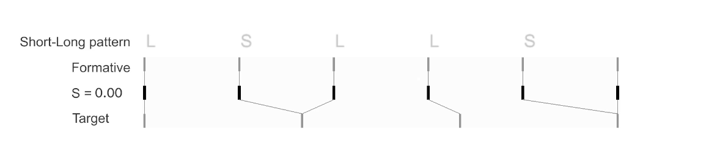
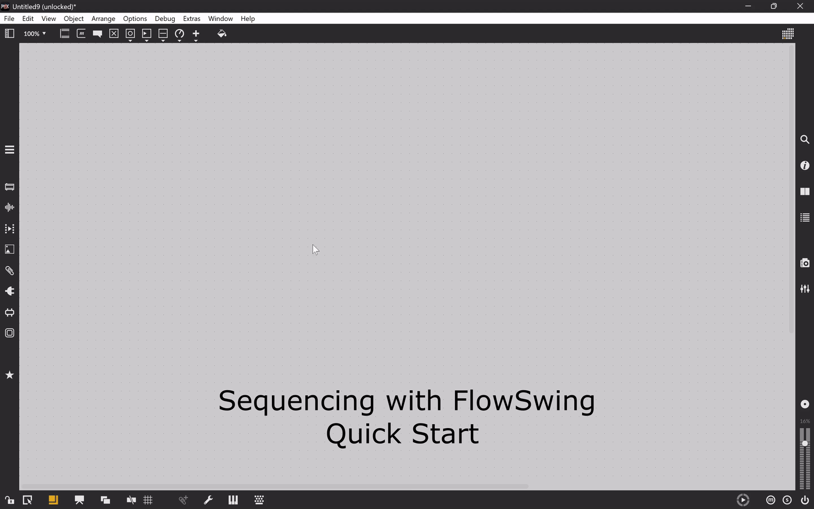

FlowSwing is a Max/MSP package for real-time rhythmic transformation based on Non-Isochronous (NI) Grids. Unlike the isochronous grids of most DAWs, NI Grids generate flexible reference structures of unequal subdivisions from a small set of parameters, supporting systematic and expressive approaches to rhythm and enabling realtime variation of complex timing patterns without complex manual timing edits. 

FlowSwing provides tools for time-warping audio, shaping control signals, and sample-accurate sequencing, with warp markers and breakpoints that can be dynamically aligned to NI Grids and adjusted during performance. All parameters are MIDI-mappable, exposed to Max’s pattr and snapshot systems, and can be fully integrated into larger Max projects. Applications range from subtle timing shifts to complex polyrhythmic interactions. FlowSwing optionally uses the FluCoMa package for onset detection, but all other features function independently.



- Real-time time-warping of audio and control-rate signals
- Sample accurate sequencing
- Non-Isochronous Grid (NI Grid) based timing
- Performance-oriented controls
- Example and help patches to get started quickly

## Requirements

- Max 9 or later is required (uses the newer JavaScript V8 engine).
- Scripts compatible with the older `js` object (JavaScript 1.8.5) are also provided for earlier Max versions.

## Installation

Option A: Download as a ZIP
1. Download the latest version of this repository as a ZIP.
2. Unzip and place the folder into your Max Packages directory, for example:
   - macOS: ~/Documents/Max 9/Packages
   - Windows: C:\Users\<you>\Documents\Max 9\Packages
3. Restart Max.

Option B: Clone with Git
1. Open a terminal in your Max Packages directory.
2. Run:
   ```
   git clone https://github.com/sioros/FlowSwing-Max-MSP.git
   ```
3. Restart Max.

## Quick Start

1. Install FlowSwing (see Installation above) and open Max.
2. In the Max Package Browser, choose "Installed Packages"
3. Search for "FlowSwing"
4. Click on Launch to open the overview patch
5. Open the examples and help patches to hear NI Grid-based timing and time-warping in action.

## Usage

1. Create a new Max/MSP object (type N on an unlocked Max patch)
2. type flowSwing.envelop or flowSwing.audioWarp to create a flowSwing instance



## Updates and Maintenance

This repository is actively maintained and regularly updated with new features, usage examples, and bug fixes. To stay current, pull the latest changes or download the newest ZIP periodically.

## Changes from Version 1 to Version 2

**Version 1** was a pre-release corresponding to the description in the SMC2025 paper (Sioros & Klissouras, 2025).
**Version 2** introduces new features, a redesigned UI, and an improved DSP engine with bug fixes and better performance. It remains backwards compatible.  

### Highlights in Version 2
- **Pattern locking:** Events are now associated with the nearest NI Grid beat (instead of the formative beat), offering more flexible alignment options.  
- **Parameter reset button:** Quickly revert T, S, and R values to the state they had when the pattern was locked.  
- **Custom patch names:** Add short descriptive labels directly on the UI.  
- **Reworked UI layout:** More convenient sizing options, including switchable views of either the NI Grid or breakpoints/markers.  
- **Improved stability:** Numerous bug fixes.  
- **Faster loading:** Fewer `jsui` objects for quicker initialization, especially in patches with many instances.  
- **Optimised DSP:** More efficient processing with reduced CPU usage.  
- **Documentation updates:** Revised help patches and reference files.
- **Examples and utilities:** several examples and utilities including for breakpoints/markers conversion.

*(Additional minor changes and refinements are not listed here.)*


## Troubleshooting

- FlowSwing not found in Max: Verify the package folder is directly inside the Max 9/Packages directory and restart Max.
- JavaScript/V8 errors: Ensure you are running Max 9+; for earlier versions, load the provided legacy scripts (XXXX_js185.js) in js objects instead of v8. If no legacy script is included, the same file works with both js and v8 objects.

## Contributing

Contributions are welcome. If you find a bug or have an idea for an enhancement:
- Fork the repository and submit a pull request with clear description and rationale.
- Include minimal example patches or steps to reproduce when reporting issues.

## License

This project is released under the license specified in the repository. See the license information in the LICENCE file for details.

## Citation

If you use FlowSwing in academic work, please cite the original papers:

Sioros, G., & Klissouras, O. (2025). Flow Swing: A system for dynamic control and exploration of non-isochronous timing in musical rhythms. Proceedings of the 22nd Sound and Music Computing Conference (SMC2025). Graz, Austria.

Sioros, G. (2023). Polyrhythmic modelling of non-isochronous and microtiming patterns. Proceedings of the 24th International Society for Music Information Retrieval Conference. Milan, Italy.

## Source code and updates: 

https://github.com/sioros/FlowSwing-Max-MSP